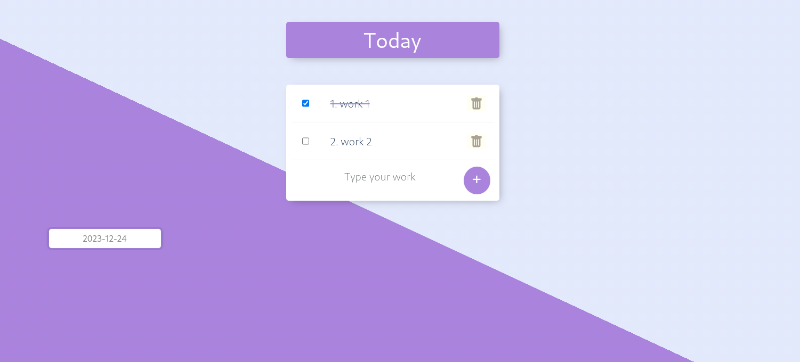

# Todo List Project

Đây là dự án Todo List, nơi bạn có thể quản lý công việc hàng ngày của mình. Dự án được xây dựng bằng cách sử dụng các gói công nghệ sau:

- **Express:** Framework web Node.js mạnh mẽ và linh hoạt.
- **EJS:** Hệ thống template engine để tạo giao diện người dùng dễ đọc và dễ duyệt.
- **Mongoose:** Thư viện ODM (Object Data Modeling) cho MongoDB, giúp tương tác với cơ sở dữ liệu MongoDB dễ dàng.



## Hướng Dẫn Cài Đặt

1. **Clone dự án từ GitHub:**

    ```bash
    git clone https://github.com/your-username/todo-list-project.git
    cd todo-list-project
    ```

2. **Cài đặt các gói phụ thuộc:**

    ```bash
    npm install
    ```

3. **Cấu hình biến môi trường:**

    Tạo một file `.env` trong thư mục gốc và cấu hình các biến môi trường như sau:

    ```env
    DATABASE_URL=mongodb://localhost:27017/todo-list-db
    ```

4. **Chạy ứng dụng:**

    ```bash
    npm start
    ```

5. **Mở trình duyệt và truy cập [http://localhost:3000](http://localhost:3000) để bắt đầu sử dụng Todo List.**

## Đóng Góp

Nếu bạn muốn đóng góp vào dự án, hãy mở một Pull Request hoặc báo cáo lỗi tại [https://github.com/your-username/todo-list-project/issues](https://github.com/your-username/todo-list-project/issues).

## Giấy Phép

Dự án này được phân phối miễn phí dưới mọi hình thức.